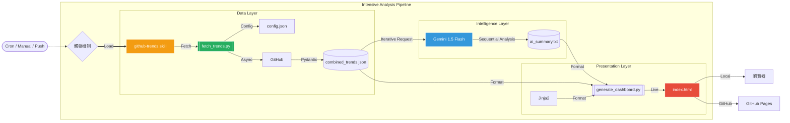

# GitHub Tech Radar (Gemini CLI Skill)

[](https://sunhua12.github.io/github-trends-analyst/)

一個結合 **AI 智能代理**與**異步數據抓取**的 GitHub 技術趨勢分析系統。本專案以 **Gemini CLI Skill** 為核心，旨在為開發者提供最具深度的開源生態洞察。

## 🚀 核心功能

- **100% AI 分析覆蓋**：採用「逐主題流水線分析」技術，確保儀表板上的每一個專案都能獲得 Gemini 1.5 Flash 的精準解讀，絕不遺漏。
- **三位一體深度洞察**：
  1. **Strategic Summary**: 宏觀分析全球技術趨勢。
  2. **Ecosystem Scan**: 針對特定語言（Python, Rust 等）的 5 維度趨勢掃描。
  3. **Row-level Insights**: 針對每個專案提供「技術核心解析」與「社群評價」。
- **整合式數據表格**：全新 UI 設計，將原始數據與 AI 意見完美融合，消除資訊碎片化，提供極致的閱讀體驗。
- **配置驅動 (Config-Driven)**：透過 `config.json` 管理多個追蹤主題，支援 All, Python, Rust, Go, TypeScript 等並行抓取。
- **自動化 CI/CD**：整合 GitHub Actions，每日凌晨自動更新並發布至 GitHub Pages。

## 📊 專案流程架構 (Mermaid)



## 📦 安裝與使用

1. **依賴安裝**：
   ```bash
   pip install httpx beautifulsoup4 pydantic jinja2 google-genai pytest
   ```

2. **本地執行**：
   ```bash
   export GEMINI_API_KEY="您的金鑰"
   ./trigger.sh
   ```

3. **自定義主題**：
   修改 `config.json` 中的 `topics` 清單即可擴充追蹤的主題。

## 📂 專案架構

```text
github-trends/
├── scripts/
│   ├── fetch_trends.py       # 異步並行爬蟲與排名對比
│   ├── ai_analyzer.py        # 逐主題結構化分析引擎
│   └── generate_dashboard.py  # 整合式儀表板生成器
├── assets/
│   └── dashboard_template.html # Jinja2 現代化表格模板
├── config.json               # 追蹤主題設定檔
├── trigger.sh                # 全自動執行腳本
├── SKILL.md                  # 技能定義與工作流
└── README.md                 # 專案文件
```

---
Generated by Gemini CLI | [sunhua12](https://github.com/sunhua12)
