# GitHub Trends Analyst (Gemini CLI Skill)

一個結合 **AI 智能分析**與**自動化數據抓取**的 GitHub 趨勢觀測工具。本專案以 **Gemini CLI Skill** 的形式開發，旨在幫助開發者快速掌握技術風口。

## 🚀 核心功能

- **異步數據抓取**：採用 `httpx` 與 `asyncio` 技術，並行獲取多個技術主題（如 Python, Rust, Go）的熱門專案。
- **歷史排名追蹤**：自動對比前次抓取數據，並在儀表板中標註 **New (新進榜)**、**Rising (上升)** 與 **Falling (下降)** 狀態。
- **配置驅動 (Config-Driven)**：透過 `config.json` 輕鬆管理追蹤主題，無需修改程式碼即可擴充追蹤語言。
- **AI 深度洞察**：利用 Gemini 1.5 Flash 對多維度數據進行交叉分析，產出專業的技術趨勢摘要。
- **交互式儀表板**：生成具備即時搜尋與分區導航功能的現代化 HTML 報告。

## 📊 專案流程架構 (Mermaid)

```mermaid
graph LR
    %% Trigger Phase
    Start([User / Cron / Manual]) -.-> Trigger{觸發機制}

    subgraph "Gemini CLI Skill Pipeline"
        direction LR
        Trigger ==>|Init| Skill[github-trends.skill]
        
        subgraph "數據獲取 (Data Acquisition)"
            Skill -->|Execute| Fetcher[[fetch_trends.py]]
            Fetcher -- Config --> CFG[config.json]
            Fetcher -- Async HTTP --> GH[GitHub Trending]
            GH -- Pydantic --> RawData[(combined_trends.json)]
        end

        subgraph "智能合成 (Intelligence)"
            RawData -->|Context| AI[Gemini 1.5 Flash]
            AI -- Insight --> Report[趨勢洞察摘要]
        end

        subgraph "視覺呈現 (Visualization)"
            Report & RawData & Template[Jinja2 Template] -->|Format| Generator[[generate_dashboard.py]]
            Generator -->|Output| Index[index.html]
        end
    end

    %% Distribution Phase
    Index -->|Local| Browser[瀏覽器預覽]
    Index -->|Remote| Git[GitHub Private Repo]
    Git -->|Hosting| Pages[GitHub Pages]

    %% Enhanced Styling
    style Skill fill:#f39c12,stroke:#fff,stroke-width:2px,color:#fff
    style Fetcher fill:#27ae60,stroke:#fff,stroke-width:2px,color:#fff
    style Generator fill:#27ae60,stroke:#fff,stroke-width:2px,color:#fff
    style AI fill:#3498db,stroke:#fff,stroke-width:2px,color:#fff
    style RawData fill:#ecf0f1,stroke:#333,stroke-dasharray: 5 5
    style Index fill:#e74c3c,stroke:#fff,stroke-width:2px,color:#fff
    style Pages fill:#2c3e50,stroke:#fff,stroke-width:2px,color:#fff
```



## 📦 安裝說明

1. **環境準備**：
   確保您的系統已安裝 Python 3.10+ 及相關依賴：
   ```bash
   pip install httpx beautifulsoup4 pydantic jinja2 google-genai pytest pytest-asyncio
   ```

2. **設定 API Key**：
   在環境變數或 GitHub Secrets 中設定 `GEMINI_API_KEY`。

3. **安裝 Skill**：
   在 Gemini CLI 中執行 `/skills reload` 即可。

## 📖 使用方法

### 透過對話指令 (Gemini CLI)
- 「分析這週最熱門的 Python 與 Rust 專案」
- 「更新我的 GitHub 趨勢儀表板」

### 本地一鍵更新 (自動化)
```bash
# 執行一鍵更新腳本
./trigger.sh
```

### 修改追蹤主題
編輯 `config.json`：
```json
{
    "topics": [
        {"id": "python", "name": "AI/Python"},
        {"id": "rust", "name": "Rust Ecosystem"}
    ]
}
```

## 📂 專案架構

```text
github-trends/
├── scripts/
│   ├── fetch_trends.py       # 異步爬蟲與排名對比邏輯
│   ├── ai_analyzer.py        # Gemini SDK 趨勢分析
│   └── generate_dashboard.py  # Jinja2 儀表板生成器
├── assets/
│   └── dashboard_template.html # Jinja2 HTML 視覺模板
├── tests/                    # 單元測試套件 (pytest)
├── config.json               # 追蹤主題設定檔
├── trigger.sh                # 一鍵執行腳本
├── SKILL.md                  # 技能定義與 AI 工作流
└── README.md                 # 專案文件 (本檔案)
```

---
Generated with ❤️ by Gemini CLI
