# GitHub Trends Analyst (Gemini CLI Skill)

一個結合 **AI 智能分析**與**自動化數據抓取**的 GitHub 趨勢觀測工具。本專案以 **Gemini CLI Skill** 的形式開發，旨在幫助開發者快速掌握技術風口。

## 🚀 核心功能

- **實時數據抓取**：利用 Python 爬蟲精確獲取 GitHub Trending 頁面的熱門專案資訊（包含專案描述與星數）。
- **AI 趨勢洞察**：透過 Gemini LLM 對專案內容進行主題建模，分析當前技術趨勢（如 AI Agent, Web3, DevTools 等）。
- **美觀儀表板**：自動生成現代化的 HTML 儀表板，提供直觀的視覺化呈現。
- **Skill 整合**：完美嵌入 Gemini CLI 工作流，支援透過對話指令啟動全自動分析。

## 🛠️ 技術棧

- **Python**: `requests`, `beautifulsoup4` (用於網頁抓取)
- **Frontend**: Vanilla HTML/CSS (GitHub Dark Theme 風格)
- **Integration**: Gemini CLI Skill (基於 MCP 概念的工具整合)

## 📊 專案流程架構 (Mermaid)

```mermaid
graph LR
    %% Trigger Phase
    Start([User / Cron / Manual]) -.-> Trigger{觸發機制}

    subgraph "Gemini CLI Skill Pipeline"
        direction LR
        Trigger ==>|Init| Skill[github-trends.skill]
        
        subgraph "數據獲取 (Data Acquisition)"
            Skill -->|Execute| Fetcher[[fetch_trends.py]]
            Fetcher -- HTTP Get --> GH[GitHub Trending]
            GH -- Async Parser --> RawData[(combined_trends.json)]
        end

        subgraph "智能合成 (Intelligence)"
            RawData -->|Context| AI[Gemini 1.5 Flash]
            AI -- Insight --> Report[趨勢洞察摘要]
        end

        subgraph "視覺呈現 (Visualization)"
            Report & RawData & Template[Jinja2 Template] -->|Format| Generator[[generate_dashboard.py]]
            Generator -->|Output| Index[index.html]
        end
    end

    %% Distribution Phase
    Index -->|Local| Browser[瀏覽器預覽]
    Index -->|Remote| Git[GitHub Private Repo]
    Git -->|Hosting| Pages[GitHub Pages]

    %% Enhanced Styling
    style Skill fill:#f39c12,stroke:#fff,stroke-width:2px,color:#fff
    style Fetcher fill:#27ae60,stroke:#fff,stroke-width:2px,color:#fff
    style Generator fill:#27ae60,stroke:#fff,stroke-width:2px,color:#fff
    style AI fill:#3498db,stroke:#fff,stroke-width:2px,color:#fff
    style RawData fill:#ecf0f1,stroke:#333,stroke-dasharray: 5 5
    style Index fill:#e74c3c,stroke:#fff,stroke-width:2px,color:#fff
    style Pages fill:#2c3e50,stroke:#fff,stroke-width:2px,color:#fff
```



## 📦 安裝說明

1. **環境準備**：
   確保您的系統已安裝 Python 3.x 及相關依賴：
   ```bash
   pip install requests beautifulsoup4
   ```

2. **安裝 Skill**：
   在 Gemini CLI 中執行：
   ```bash
   # 若您已有打包好的 .skill 檔案
   gemini skills install <path-to-skill-file> --scope workspace
   ```

3. **重新載入**：
   ```bash
   /skills reload
   ```

## 📖 使用方法

### 透過 Gemini CLI 對話 (推薦)
直接對 Gemini 說：
- 「分析這週最熱門的 Python 專案」
- 「幫我生成一份 Java 趨勢儀表板」

### 手動執行腳本
1. **抓取數據**：
   ```bash
   python scripts/fetch_trends.py --lang python --since weekly --format json > trends.json
   ```
2. **生成儀表板**：
   ```bash
   python scripts/generate_dashboard.py --input trends.json --analysis "AI 分析摘要內容" --template assets/dashboard_template.html --output my_dashboard.html
   ```

## 📂 專案架構

```text
github-trends/
├── scripts/
│   ├── fetch_trends.py       # GitHub 爬蟲腳本
│   └── generate_dashboard.py  # 儀表板生成器
├── assets/
│   └── dashboard_template.html # HTML 視覺模板
├── SKILL.md                  # 技能定義與 AI 工作流說明
└── README.md                 # 專案文件 (本檔案)
```

---
Generated with ❤️ by Gemini CLI
